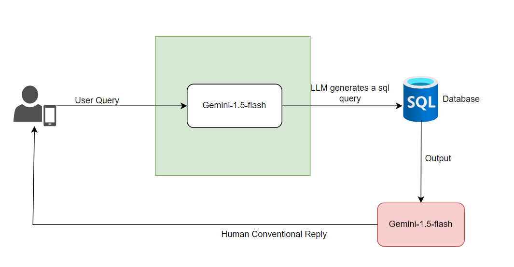

# ShopWise Assistant

## Overview
ShopWise Assistant is a **Streamlit-based web application** designed to assist users with various tasks such as tracking orders, retrieving product details, and generating SQL queries using the Gemini API. The application leverages **SQLite** for database operations and integrates with the **Gemini API** for natural language processing.

## Features
- **Order Tracking**: Users can enter an order ID to retrieve the current status of their order.
- **Product Details**: Users can enter a product ID to get detailed information about a product.
- **Chat Interface**: Users can interact with the assistant by asking questions or entering SQL queries.
- **Custom Styling**: The application includes custom CSS for a better user experience.
- **Logging**: The application uses logging to track events and errors.

## Architecture



## Requirements
- **Python 3.x**
- **Streamlit**
- **Pillow**
- **google-generativeai**
- **sqlite3**
- **python-dotenv**

## Installation
1. Clone the repository:
   ```bash
   git clone https://github.com/shashanktu/shopwise-assistant.git
2. Navigate to the project directory:
    ```bash
     cd shopwise-assistant
3. Install the required packages:
    ```bash
     pip install -r requirements.txt
4. Create a .env file in the project directory and add your Gemini API key:
    ```plaintext
     GEMINI_API_KEY=your_gemini_api_key

## Usage
1. Run the streamlit application:
    ```bash
     streamlit run bot.py
2. Open your web browser and navigate to the URL provided by Streamlit (usually http://localhost:8501).

## Code Structure
- **`bot.py`**: The main application file containing all the logic and UI components.
- **`synthetic.db`**: The database where all the data of the products and orders are stored
- **`.env`**: Environment file to store sensitive information like API keys.

## Functions
- **`read_sql_query(sql, db)`**: Executes an SQL query on the specified database and returns the results.
- **`get_gemini_response(user_message)`**: Sends a user message to the Gemini API and returns the generated response.
- **`is_greeting(user_message)`**: Checks if the user message is a greeting.
- **`get_random_greeting()`**: Returns a random greeting message.
- **`is_sql_query(user_message)`**: Checks if the user message contains SQL keywords.
- **`extract_sql_query(text)`**: Extracts an SQL query from the given text.

## Demo
[Bot Demo Video](bot-demo.mp4)
## Team
For inquiries, feel free to reach out via email:

- [anirban.mondal@valuemomentum.com](mailto:anirban.mondal@valuemomentum.com)
- [prashant.kulkarni@valuemomentum.com](mailto:prashant.kulkarni@valuemomentum.com)
- [divakar.kadupu@valuemomentum.com](mailto:divakar.kadupu@valuemomentum.com)
- [akhilesh.karra@valuemomentum.com](mailto:akhilesh.karra@valuemomentum.com)
- [shashank.tudum@valuemomentum.com](mailto:shashank.tudum@valuemomentum.com)

  


